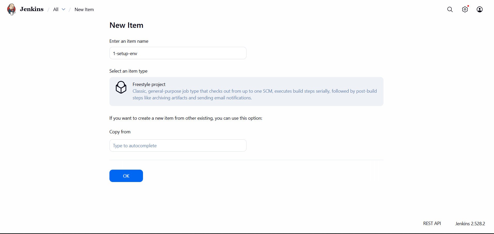
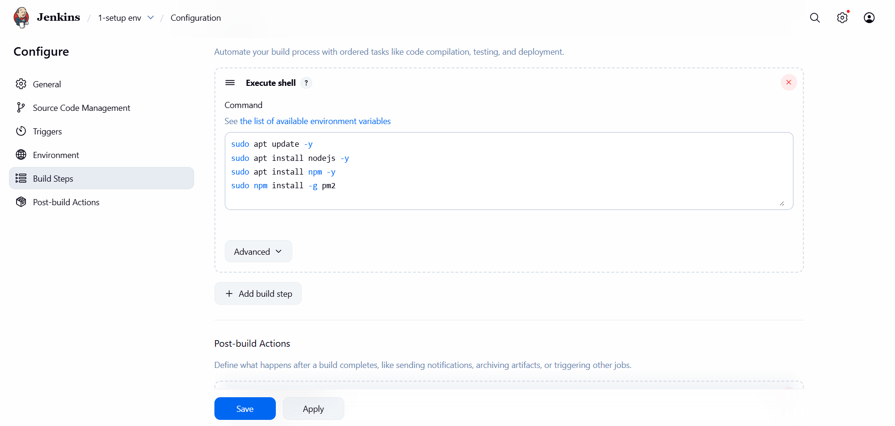
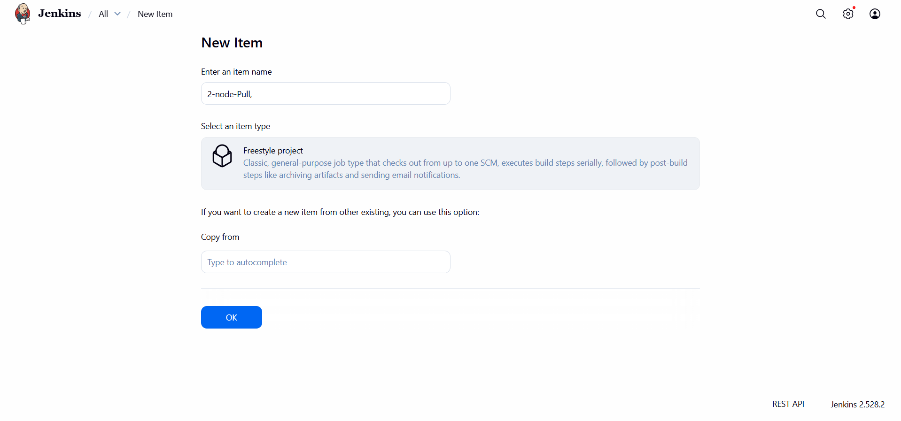
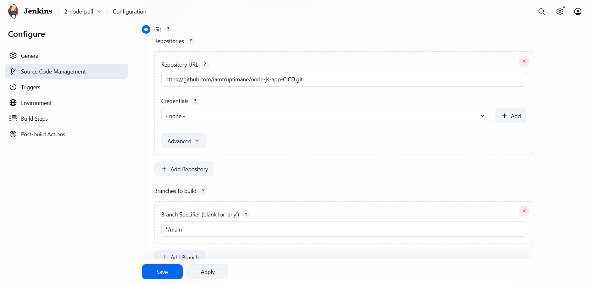
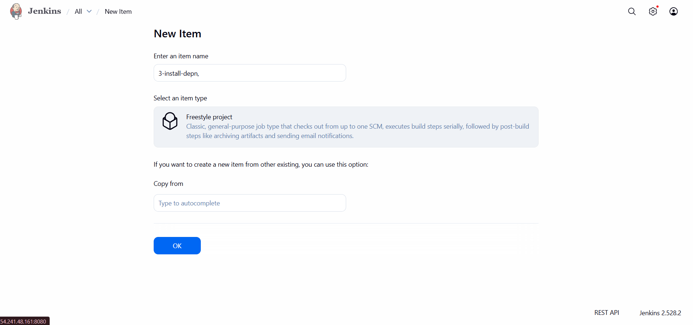
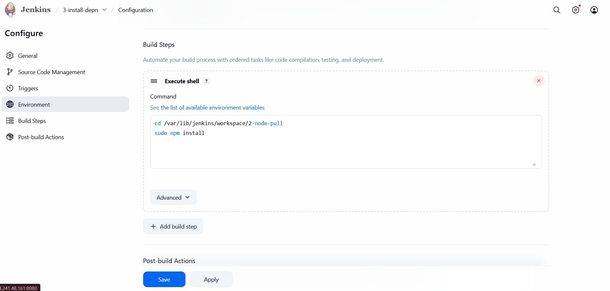
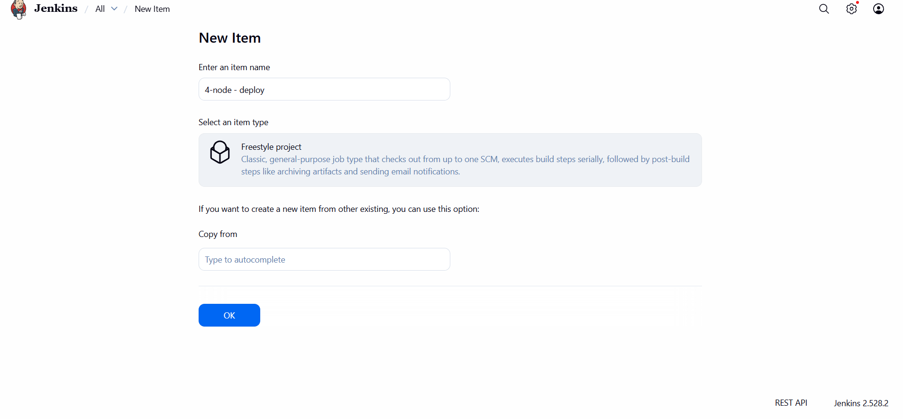
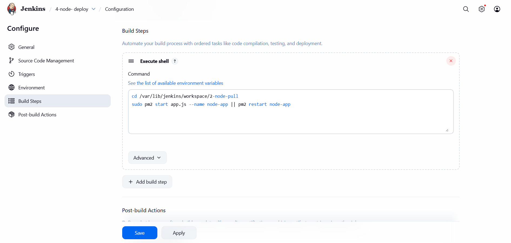
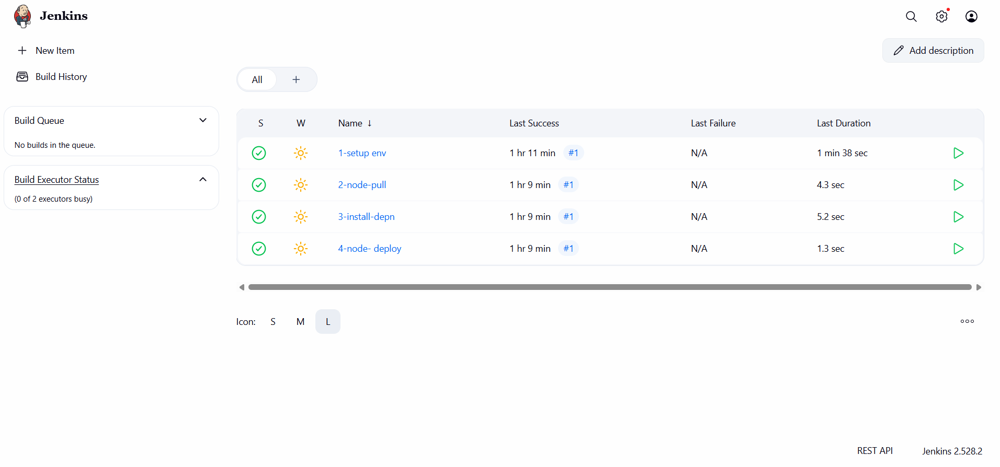
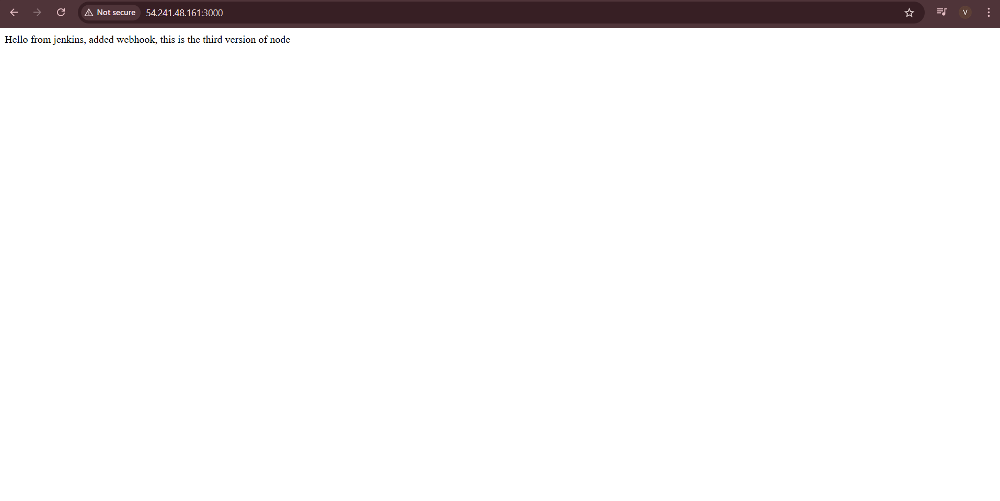

# 🚀Node.js Deployment Freestyle Project Using Jenkins
Automating your Node.js app deployment with Jenkins helps you deliver updates faster and more reliably.
In this tutorial, you will learn how to set up Jenkins freestyle projects.
Jenkins will pull your code from GitHub, install the needed packages, and deploy your Node.js app.
You will use pm2 to run and manage your app.

<hr>

### Setting Up Jenkins Freestyle Project
We will create four Jenkins freestyle jobs to automate the deployment pipeline:

* Job-1  ___1-setup-env___: install node, npm and pm2
      
* job-2: ___2-node-pull___: Pull source code from Git.

* job-3: ___3-install-depn___: Install Node.js dependencies.

* job-4: ___4-node- deploy___: Deploy the Node.js application using PM2.
<hr>

### Job-1: setup environment
* Click New Item.
* Enter name: `1-setup-env`.
* Choose Freestyle project, click OK.



* __Bulid Steps__ > __Execute shell:__
```
sudo apt install nodejs -y
sudo apt install npm -y
sudo npm install -g pm2
```


* __Add Post-bulid Action__ > __Bulid other project__
  
  - Enter downstream job's name: `2-node-pull`

  - Then click save


<hr>

### Job-2: Pull repo from github
* Click New Item.
* Enter name: `2-node-pull`.
* Choose Freestyle project, click OK.



* Source Code Management, select __Git__.
* Enter your Git repository URL, e.g.: https://github.com/iamtruptimane/node-js-app-CICD.git

* __Branch:__ `main`



* __Add Post-bulid Action__ > __Bulid other project__
  
  - Enter downstream job's name: `3-install-depn`

  - Then click save

<hr>

### Job-3: Install Dependencies
* Click New Item.
* Enter name: `3-install-depn`.
* Choose Freestyle project, click OK.



* __Bulid Steps__ > __Execute shell:__
```
cd /var/lib/jenkins/workspace/node-pull-repo
sudo npm install
```



* __Add Post-bulid Action__ > __Bulid other project__
  
  - Enter downstream job's name: `4-node- deploy`

  - Then click save
  
<hr>

### Job-4: Install Dependencies
* Click New Item.
* Enter name: `4-node- deploy`.
* Choose Freestyle project, click OK.



* __Bulid Steps__ > __Execute shell:__
```
cd /var/lib/jenkins/workspace/node-pull-repo
pm2 start app.js --name node-app || pm2 restart node-app
```


- Then click save

<hr>

### Running the Pipeline
1. Go to Jenkins dashboard.
2. Click on __1-setup-env__.
3. Click __Build Now__.
4. This will trigger the downstream jobs in order:
   * __1-setup-env__ (install node,    npm and pm2)
   * then __2-node-pull__ (pull code),
   * then __3-install-depn__(install dependencies),
   * then __4-node- deploy__(deploy app).

   

   ### Access Application
open browser and go to

```
<Public-IP>:3000
```


<hr>

### Conclusion
By setting up Node.js deployment on Jenkins using freestyle projects, you’ve built a simple yet effective Freestyle pipeline that automates pulling code from a repository, installing dependencies, and deploying the application with pm2.

<hr>